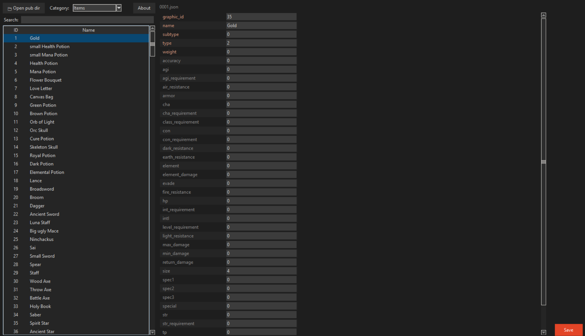

# EOJson

A lightweight JSON pub file editor for reoserv / Endless Online servers.

EOjson works alongside [pub2json](https://github.com/sorokya/pub2json) — use pub2json to convert your binary `.eif`, `.enf`, `.ecf`, `.esf` files to JSON, then use EOJson to browse and edit them with a clean dark-themed interface.



## Features

- Browse Items, NPCs, Classes, Spells, Shops, Inns, and Skill Masters
- Search across all categories — auto-switches category when a match is found elsewhere
- Edit all fields inline and save back to JSON
- No dependencies beyond Python's built-in `tkinter`

## Requirements

- Python 3.8+
- [pub2json](https://github.com/sorokya/pub2json) to generate JSON files from your existing pub files

## Usage

```bash
python main.py
```

Select your pub JSON directory on launch (the folder containing `items/`, `npcs/`, `classes/`, etc.)

## Getting Started

1. Install [pub2json](https://github.com/sorokya/pub2json) and convert your pub files:
   ```bash
   pub2json --pubs ./pub --json ./pub_json
   ```
2. Run EOJson and select the output folder when prompted.
3. Browse and edit your pub data.

## Building an Executable

You can package EOJson into a standalone `.exe` so users don't need Python installed.

1. Install PyInstaller:
   ```bash
   pip install pyinstaller
   ```

2. Build the executable:
   ```bash
   pyinstaller --onefile --windowed --icon=eojson-icon.png --name=EOJson main.py
   ```

3. The output will be in the `dist/` folder as `EOJson.exe`.

> **Note:** The `eojson-icon.png` file must be in the same directory as `main.py` when building. The icon will be embedded into the exe.

## Links

- [pub2json](https://github.com/sorokya/pub2json)
